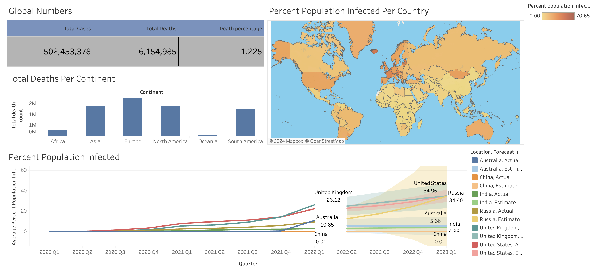

##Covid-19 Data Analysis

Examined Covid-19 data using Excel, SQL, and Tableau to understand the relationships, visualize and predict trends between multiple attributes of the Covid-19 virus such as: death count and infection count per country and continent, across multiple quarters since the onset of the pandemic.

Link to the dashboard- https://public.tableau.com/app/profile/satya.sai.koppalu/viz/CovidDashboard_16508250139320/Dashboard1

